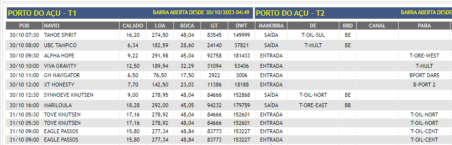

# Praticagem Scraper To Database

Este script tem como objetivo realizar o webscraping do site da praticagem RJ, transformar estes dados em uma tabela e subir para um banco de dados.

 


 # Preparando o Ubuntu

 Instale alguns packages antes como o python3 e o envpython3

 ```
 apt-get install python3
 apt-get install python3-venv
 sudo apt-get install libpq-dev
 sudo apt-get install python3-dev
 sudo apt-get install python3-pip
 ```


## Instalação no Linux / Ubuntu

Utilize os comandos abaixo para realizar a criação do ambiente virtual, ativação e instalação das dependencias necessárias.

```bash
python3 -m venv venv 
source venv/bin/activate
pip3 install -r requirements.txt
```

## Criação do arquivo .env

```env
DB_USER="your_user"
DB_PASS="your_password"
DB_HOST="your_host_name"
DB_DATABASE="your_db_name"
DB_TABLE="your_table_name"
SITE_PRATICAGEM="https://www.praticagem-rj.com.br/"
```

## Colocando para funcionar

Devido a natureza deste serviço, é necessário que criemos um script main_execute.sh para execução do mesmo da forma correto no ambiente próprio.

```bash
#!/bin/bash

# Ativa o ambiente virtual
source ~/praticagem_scraper_to_db/venv/bin/activate

# Navega até a pasta do seu projeto
cd ~/praticagem_scraper_to_db

# Execute o script Python
python3 main.py
```

## Utilizando o Cron para manter o serviço em execução continua

Abrir o arquivo cron:

Para editar as tarefas agendadas no cron, você pode usar o comando crontab -e. Isso abrirá o arquivo de cron no editor de texto padrão do sistema.

```bash
crontab -e
```
Agendar uma tarefa minuto a minuto:

Adicione a seguinte linha ao arquivo de cron para agendar uma tarefa que será executada a cada minuto:

```txt
* * * * * ~/praticagem_scraper_to_db/main_execute.sh
```